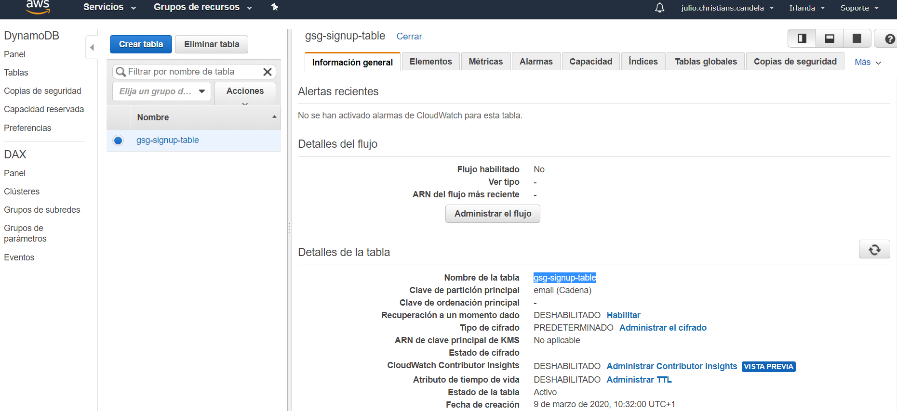
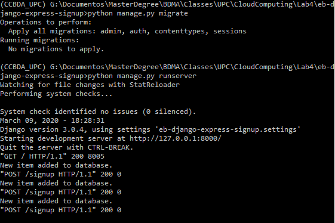
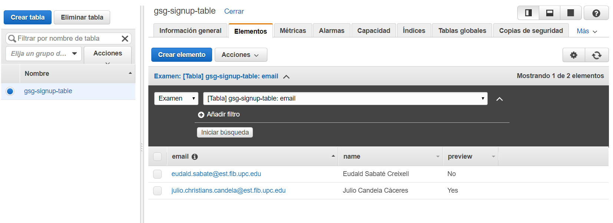
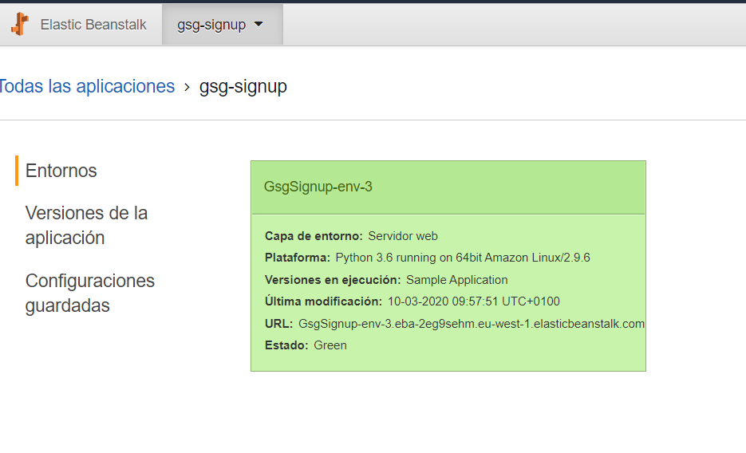
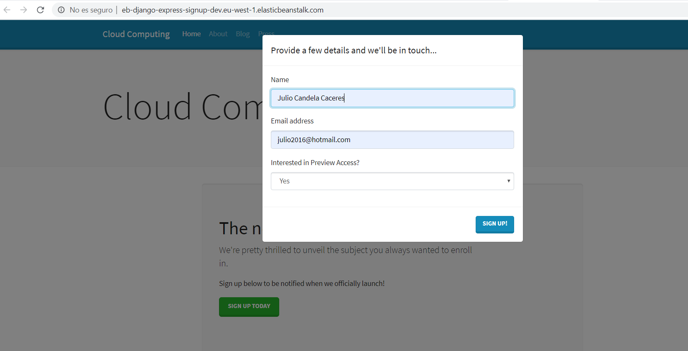
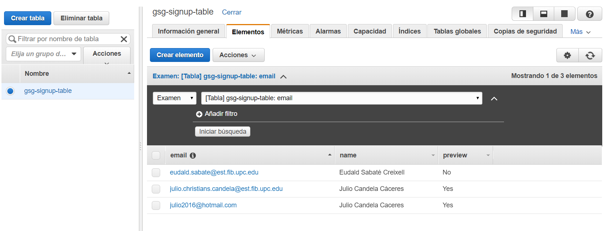

# "CLOUD-COMPUTING-CLASS-2020" 
# Lab 4: Creating a web application using cloud PaaS
## Group Members:
- Eudald Sabaté Creixell: eudald.sabate@est.fib.upc.edu
- Julio Candela: julio.christians.candela@est.fib.upc.edu

# Experimentation  

## Task 4.1: Download the repository for the Web App
 
The resources and changes for the web server can be found in the following repository: https://github.com/JulioCandela1993/eb-django-express-signup.git 

## Task 4.2: Create an IAM Policy and Role 

The IAM Policy (gsg-signup-policy) and Role (gsg-signup-role) were succesfully created 

## Task 4.3: Create a DynamoDB Table 

The gsg-signup-table was successfully created in Ireland region.

## Task 4.4: Test the web app locally

Before the execution, we had to modify the file environment.bat (Windows) since we got some problems in the set of variables (without quotes) and be sure that the aws configuration was set to the region specified (eu-west-1, you can use the command "aws configure"):

##### @ECHO OFF 
##### SET DEBUG="True" 
##### SET STARTUP_SIGNUP_TABLE=gsg-signup-table 
##### SET AWS_REGION=eu-west-1
##### ECHO %DEBUG%, %STARTUP_SIGNUP_TABLE%, %AWS_REGION%

The server is succesfully running after executing the python scripts:

In order to validate the result of the insertion, we opened the DynamoDB console in AWS and get the elements stored in the table (our email accounts, names and decisions of preview)

## Task 4.5: Create the AWS Beanstalk environment and deploy the sample web app

During these steps, we faced some problems: 
- First of all, the account must be validated in the region "Ireland". We sent an email to Amazon to allow this region for our account in EC2.
- Then, the load balancer requires at least two sub regions, so in the configuration we changed it to sub region a and b.

At the end, we could initiallize the web application:   

## Task 4.6: Configure Elastic Beanstalk CLI and deploy the target web app

After facing some problems at the beginning, we executed the new code provided by the course and the app was working without inconvenients.

By using the **eb CLI** with the `-h` parameter, we obtain the list of all the options that can be used with this tool. We will focus on the `eb create` one, which is the option in charge of creating a new environment. So, repeating the process, we use the `eb create -h` tool to find all the arguments and its usage and we found that the `-s` or `--single` parameter allows to deploy a single instance without a load balancing. 

The web application in the link: 

The new instance added to DynamoDB

## Questions

### Q45a: What has happened? Why do you think that has happened?

After manually terminating the EC2 instance that was used by ElasticBeanstalk from the EC2 terminal, the state from our environment in the EB terminal changed from **healthy** into **severe** due to the no responses received from the EC2 instances.
After waiting several minutes, we re-checked the EC2 terminal and it appeared a new EC2 instance substituting the previously terminated one. Hence, the state from our EB environment has changed from **severe** to **ok** again.

### Q45b: What has happened? Why do you think that has happened?

In this occasion, we have directly terminated the environment from the EB terminal, hence, correctly terminating the EC2 instances previously deployed and correctly terminating the EB environment as well.

### Q45c: Can you terminate the application using the command line? What is the command? if it exists.

Yes, the `eb` tool provides a way to terminate an active application by using the following arguments: `eb terminate <environment_name>`.

### Q45d: What parameters have you added to the eb create command to create your environment? Explain why you have selected each parameter.

The parameters used in the `eb create` command are the following ones: `eb create --envvars DEBUG=True,STARTUP_SIGNUP_TABLE=gsg-signup-table,AWS_REGION=eu-west-1 --service-role aws-elasticbeanstalk-service-role --elb-type classic --vpc.elbsubnets eu-west-1a`.

The `--envvars` argument allows us to define environmental variables inside the instances deployed in Elastic Beanstalk. The first environmental variable, `DEBUG=True` is used in order to show more information in the logs, the `STARTUP_SIGNUP_TABLE=gsg-signup-table` specifies the table that we want to use which we have previously created in the DynamoDB, and finally the `AWS_REGION=eu-west-1` specifies the region of the EC2 instances.
 
The `--service-role` is used in order to specify the service role that we want to use. In this case, the service role specified is the one needed for AWS EB as it already contains the default set of permissions and a trust policy that allows ElasticBeanstalk to assume the service role.

Finally, the `--elb-type classic` is used in order to avoid to manually select the load balancing instance type, while the `--vpc.elbsubnets eu-west-1a` is used to indicate the subnet that will be used for this load balancing instsance to create more EC2 instances if needed.

### Q46: How long have you been working on this session? What have been the main difficulties you have faced and how have you solved them? 

In the local execution, we faced some problems when executing from windows, but we solved it taking the quotes off. After that, the local web server executed well.

We have been working for several hours, as we encountered several issues. First, there was the problem with the environment created in the EB transitioning from healthy to severe, as it was unable to assume the role that we had previously created in the **IAM console**. To solve this issue, we just needed to update the code that the professor delivered to us, and change the `eb create` command that we were using for the one that has been described above with the new `--service-role` parameter updated, as the one that we were previously using did not have the correct permissions.

After solving this issue, we run into the next one which was that, even though we were able to correctly create the environment and deploy our application, there was an error in it and the server was not able to correctly respond when accessing it, returning and HTTP 5xx error. By checking the logs, we were able to identify that the EC2 instance created had a `sqlite3` version which was too low for the DJango framework. So we accessed the EC2 instance and upgraded it, so we solved this error.